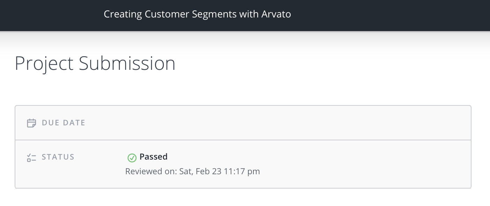

# Identify Customer Segments Review

### Meets Specifications 

Greetings Student,
It's a pleasure to have you with us at Udacity. We congratulate you for this good work and encourage you to continue working hard. Thank you and happy to work with you here.

 

## Extra Material

Please check out the following links for more on the subject matter.

- [Find Your Best Customers with Customer Segmentation in Python](https://datascienceplus.com/find-your-best-customers-with-customer-segmentation-in-python/)
- [A Quick Look at Market Segmentation](https://medium.com/@staceyferreira/a-look-at-customer-segmentation-43e053a8cef1)
- [How to use Customer Segmentation To Learn](https://medium.com/@kristenkehrer/how-to-use-customer-segmentation-to-learn-f49e82b9a959)
- [Segmentation: The Basics For Understanding Your Customers](https://medium.com/tools-for-entrepreneurs/segmentation-the-basics-for-understanding-your-customers-f835a98c8e1d)
- [Customer Segmentation - SlideShare](https://www.slideshare.net/soaresc/customer-segmentation-6010726)

### Preprocessing 

All missing values have been re-encoded in a consistent way as NaNs.

Good job converting missing values in last column to NaN. 

# Pro Tips

For more on handling missing values, please visit:

- [Handling Missing Values](https://www.kaggle.com/dansbecker/handling-missing-values/notebook)
- [How to handle missing NaNs for machine learning in python](https://stackoverflow.com/questions/27824954/how-to-handle-missing-nans-for-machine-learning-in-python)

Columns with a large amount of missing values have been removed from the analysis. Patterns in missing values have been identified between other columns.

Nicely done, All the columns which are sparse have been removed

The data has been split into two parts based on how much data is missing from each row. The subsets have been compared to see if they are qualitatively different from one another.

Nice work splitting up the data and comparing the two subsets.

Categorical features have been explored and handled based on if they are binary or multi-level.

Interesting choice of keeping and removing columns. Excellent job!

Mixed-type features have been explored, resulting in re-engineered features.

Nice work generating the new features.

Dataset includes all original features with appropriate data types and re-engineered features. Features that are not formatted for further analysis have been excluded.

Great job here!
Nicejob here including all original features with appropriate data types and re-engineered features.

A function applying pre-processing operations has been created, so that the same steps can be applied to the general and customer demographics alike.

Nice work done in the `clean_data()` function

### Feature Transformation 

Feature scaling has been properly applied to the demographics data. Imputation has been performed to remove remaining missing values.

The [Sklearn.preprocessing.StandardScaler](http://scikit-learn.org/stable/modules/generated/sklearn.preprocessing.StandardScaler.html) was used for feature scaling. Good choice!

Principal component analysis has been applied to the data to create transformed features. A variability analysis has been performed to justify a decision on the number of features to retain.

Good plot and applying PCA to the data

# Pro Tips

For further reading on PCA, you can refer these links:

- [Principal Component Analysis explained](https://www.kaggle.com/nirajvermafcb/principal-component-analysis-explained)
- [Principal Component Analysis](https://medium.com/maheshkkumar/principal-component-analysis-2d11043ff324)

Weights on at least three principal components are used to make inferences on correlations between original features of the data. General meanings are ascribed to principal components where applicable.

Good job interpreting the first three components in the principal component analysis!

### Clustering 

Multiple cluster counts have been tested on the general demographics data, and the average point-centroid distances have been reported. A decision on the number of clusters to use is made and justified.

The right choice of clusters has been chosen. Great job!

Cleaning, feature transformation, dimensionality reduction, and clustering models are applied properly to the customer demographics data.

Nicely done!
Good job using already created `sklearn` objects on the customer demographics data.

A comparison is made between the general population and customers to identify segments of the population that are central to the sales company's base as well as those that are not.

Good job here! Good comparison and the logic is reasonable.

### Comments

You could be as simple as, **when I look at cluster X, which has positive features for ... , and negative features for ...., I infer that these people belong to …**.

In short, take a step similar to the one you took while interpreting PCA, and try to answer this question: **If the customer data is under-represented in the customer base, who are these people?**

Furthermore, you could also do inverse PCA, and an inverse scalar to compare the clusters directly with the raw data.

We need to find out latent factors spread across the dataset
Financial Typology
Affinity
Density of population e.t.c

---

