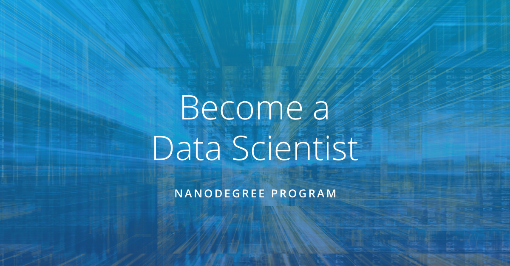
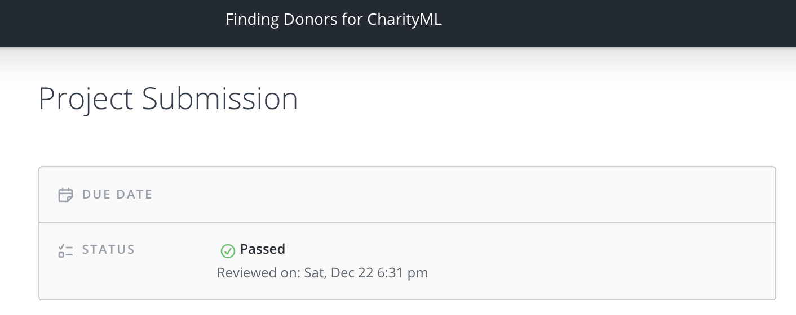
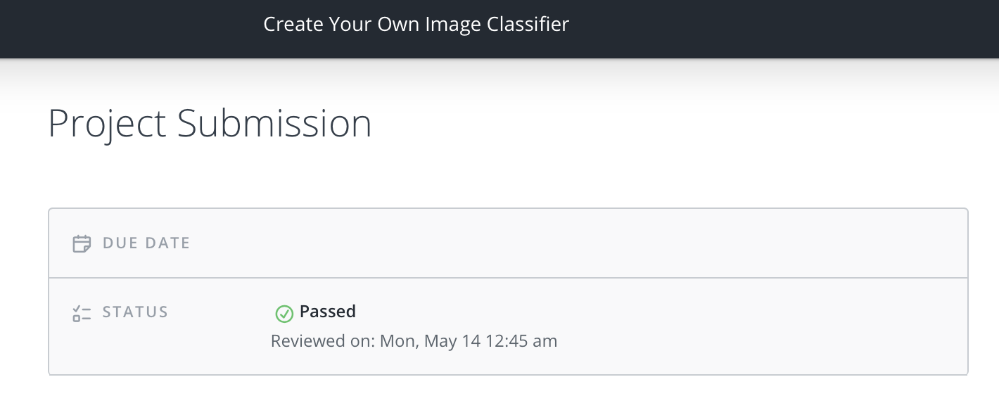
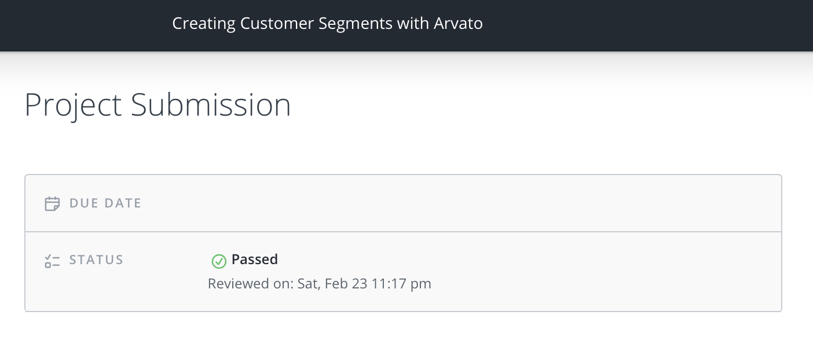

# Udacity Data Scientist Nanodegree

 

**Objectives:** learn the skills you need to perform well as a data scientist. 

 

## **Term 1: Machine Learning for Data Scientists**

 

**Period: 27 November 2018 - 24 February 2019**

 

**Project 1: Supervised Learning.** 

*Find Donors for the CharityML.*

- CharityML is a fictitious charity organization that provides financial support for people learning machine learning. In an effort to improve donor outreach effectiveness, an algorithm is build that best identifies potential donors. The goal will be to evaluate and optimize several different **supervised learners** to determine which algorithm will provide the highest donation yield.

   

  

 

**Project 2: Deep Learning.** 

*Create an Image Classifier.*

- In this project, an image classification application is implement using a a **deep learning model** on a dataset of images and the trained model is used to classify new images. First, develop code in a Jupyter notebook, second convert it into a python application that you will run from the command line of your system.

  This project is the same as the final **AI Programming with Python Nanodegree** project. 
  
   
  
  

 

**Project 3: Unsupervised Learning.** 

*Creating Customer Segments.*

- The data and design for this project is provided by Arvato Financial Services. Apply **unsupervised learning techniques** on demographic and spending data for a sample of German households. Preprocess the data, apply **dimensionality reduction techniques**, and implement **clustering algorithms** to segment customers with the goal of optimizing customer outreach for a mail order company.

   

  

 

------

*Last update: 28 September 2019*

